# Zodiac Organization

## Sun in Signs
-  ### Aries: 3/21 - 4/19
    >- linear, impatience + innovation, physical
    >- life goal: achievement
    >- croton, croton petra
    
- ### Taurus: 4/20 - 5/20
    >- solid, sensory driven/sensual, stubborn for tradition and steadiness
    >- life goal: security, possession
    >- Dieffenbachia, Dieffenbachia oerstedii
    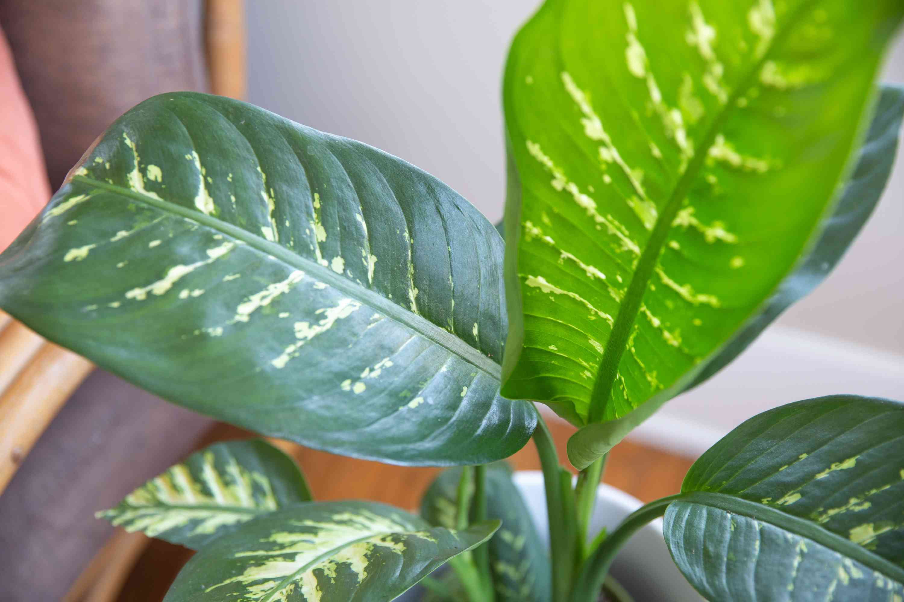
- ### Gemini: 5/21 - 6/20
    >- curious, intrusive, adaptable
    >- life goal: light, entertainment
    >- plant: Hedera, shown Hedra algeriensis
    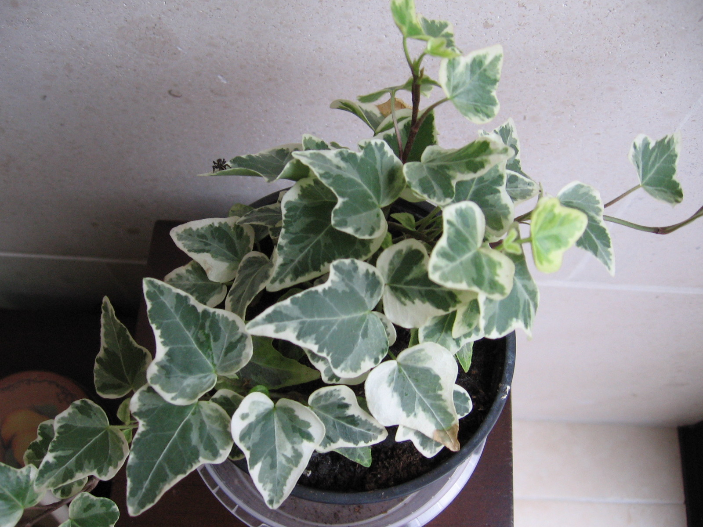
- ### Cancer: 6/21 - 7/22
    >- moody, resists change, emotion driven, hospitable
    >- life goal: connection
    >- plant: ficus, shown ficus lyrata "fiddle leaf" 
    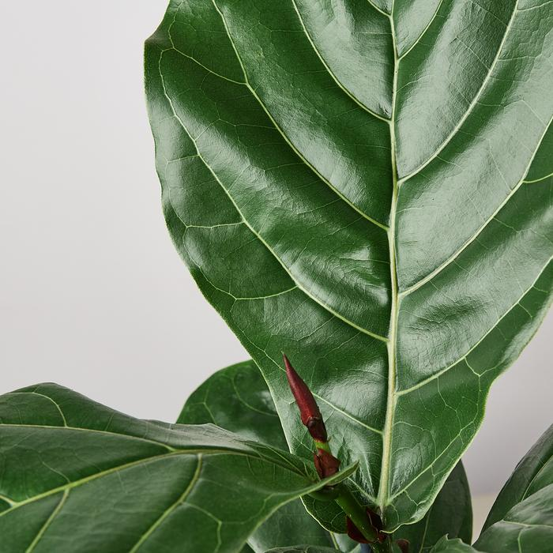
- ### Leo: 7/21 - 8/20
    >- loyal, self-connected, seeks good in life
    >- life goal: seen for positive impact
    >- plant: Monstera, Monstera Delious
    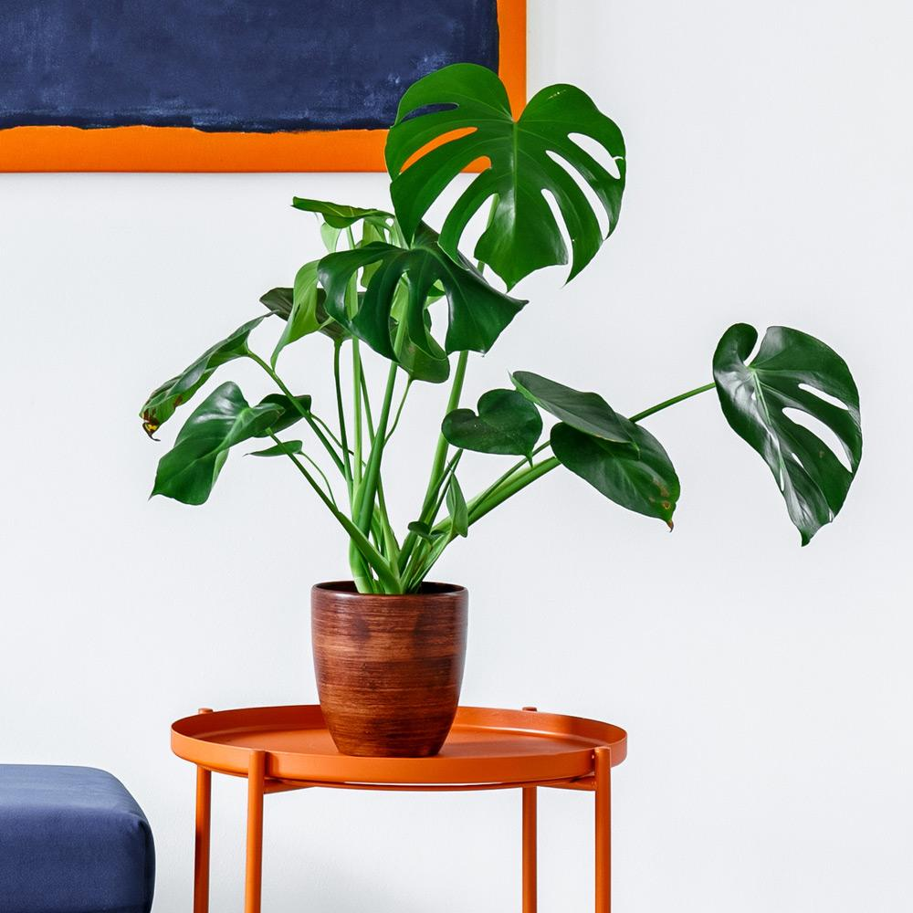
- ### Virgo: 8/21 - 9/20
    >- contained, cog like, body-conceious, perfectionist,
    >- life goal: appreciation, usefulness
    >- plant: Calathea, shown Calathea Zebrina? or Orbifolia
    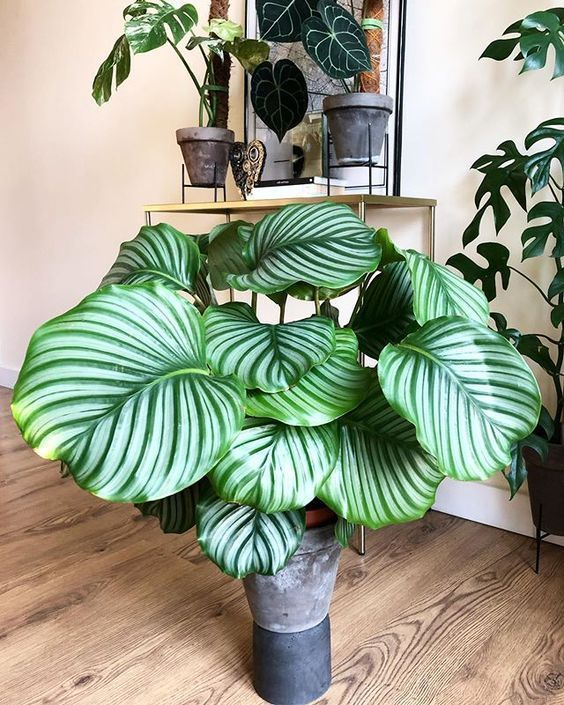
- ### Libra: 9/23 - 10/22
    >- socialable, peacemakers, rule driven
    >- life goal: harmony
    >- plant: Spathiphyllum, Spathiphyllum "sensation"
    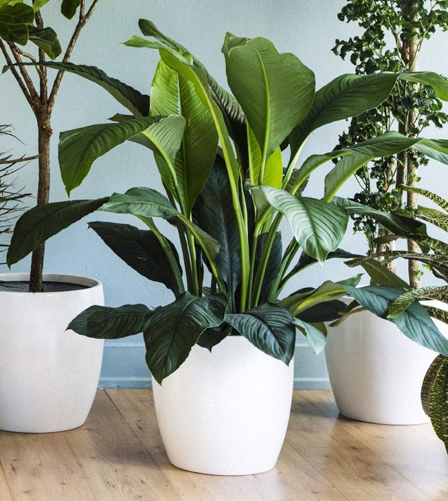
- ### Scorpio: 10/23 - 11/21
    >- intense, intentional, strategic, hands-on
    >- life goal: real power
    >- plant: Alocasia, shown alocasia reginula
    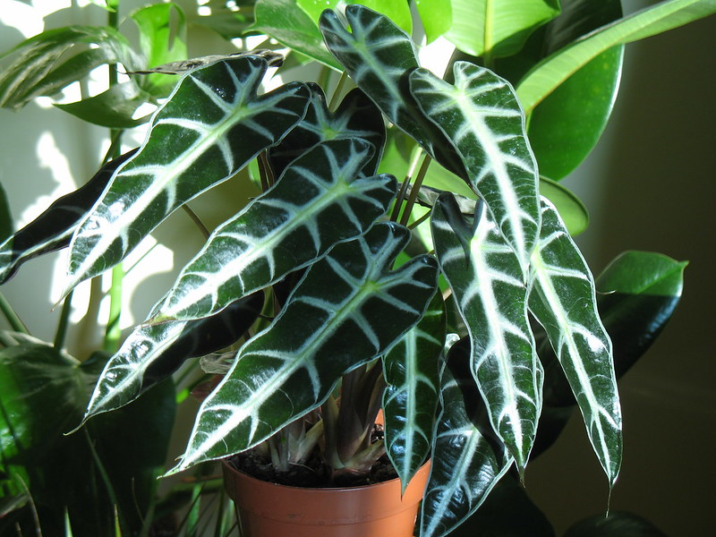
- ### Sag: 11/22 - 12/21
    >- optimistic, free, idealistic, easy-going but quick temper, forgivable
    >- life goal: freedom
    >- plant: Pothos, shown Epipremnum 
    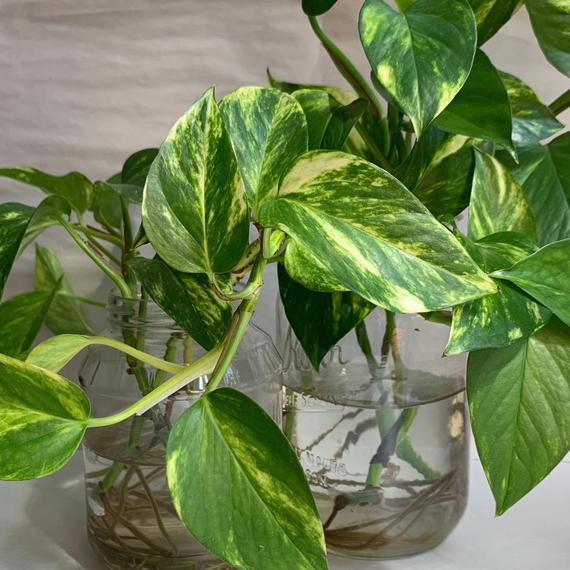
- ### Capricorn: 12/22 - 1/19
    >- grounded/realistic, determined, lonely/reserved
    >- life-goal: do/be worthwile, effective
    >- Dracaena, shown Dracanena marginata
    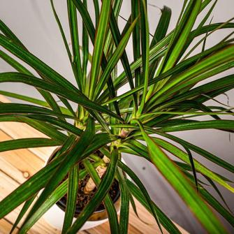
- ### Aquarius: 1/20 - 2/18
    >- unconventional, stubborn, 
    >- life-goal: individuality
    >- sansevieria, shown Sansevieria Trifasciata
    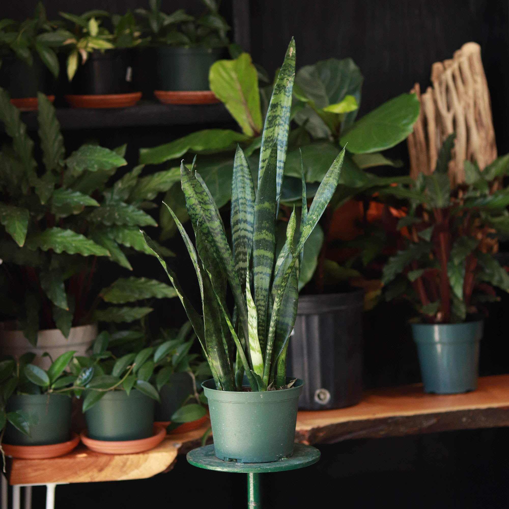
- ### Pisces: 2/19 - 3/20
    >- adaptable, dreamy/fantastical, sensitive 
    >- life-goal: authenticity
    >- plant: philodendreon, philodendreon micans
    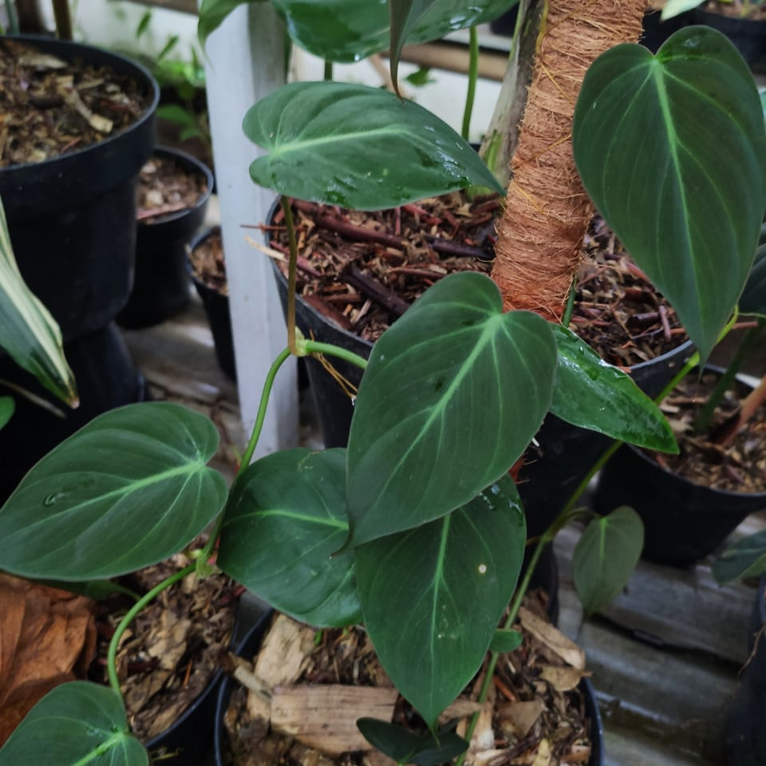